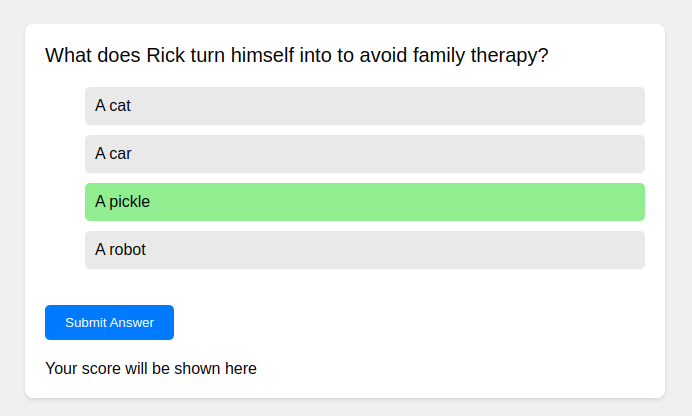

# Basic Quiz App



## Introduction
This Basic Quiz App is a simple, interactive way to create and take quizzes on various topics. Designed for educational purposes, it offers a user-friendly interface and a straightforward way to test knowledge on a range of subjects.

## Features
- Multiple-choice questions
- Immediate feedback on answers
- Final score display at the end of the quiz
- Responsive design for desktop and mobile devices

## Technologies Used
- HTML
- CSS
- JavaScript

## Setup
To run this project, download or clone the repository and open `index.html` in your browser.

```bash
git clone https://github.com/yourusername/quiz-app.git
```